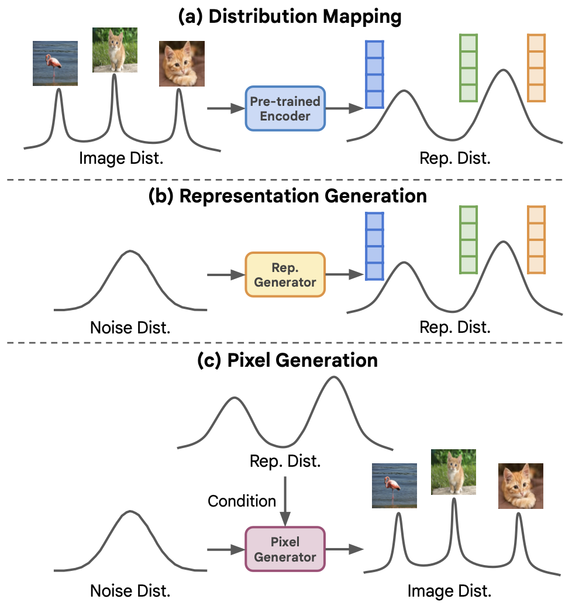
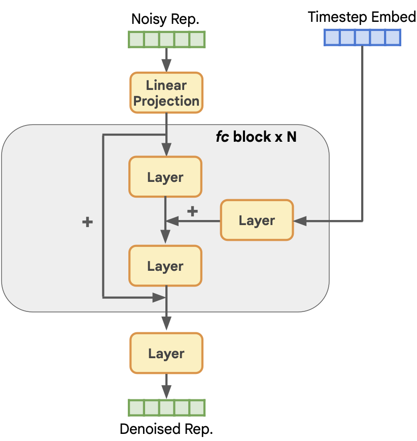
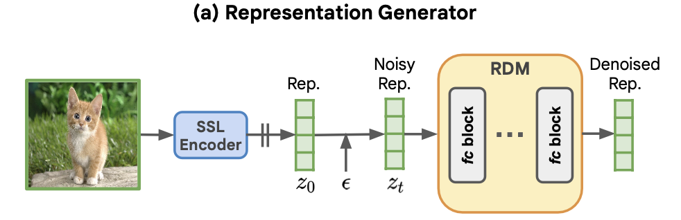
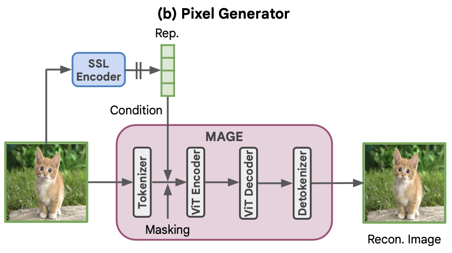
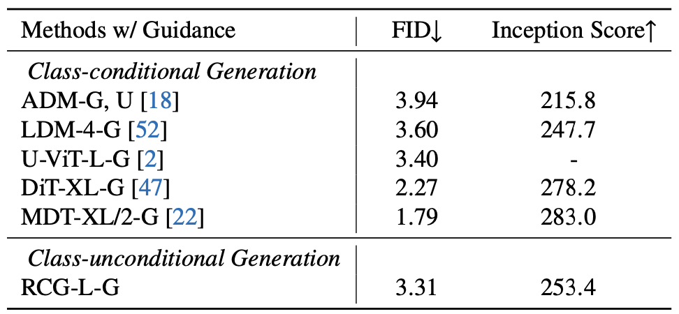
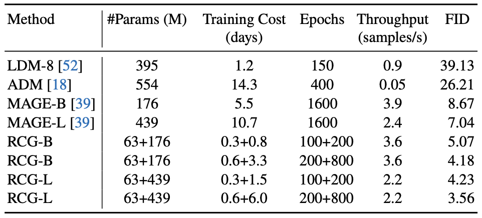
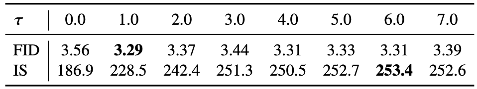
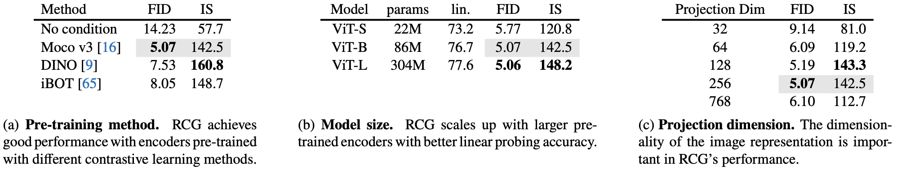
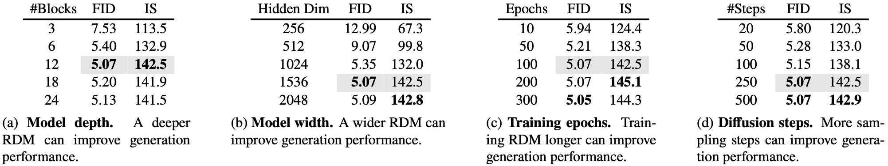
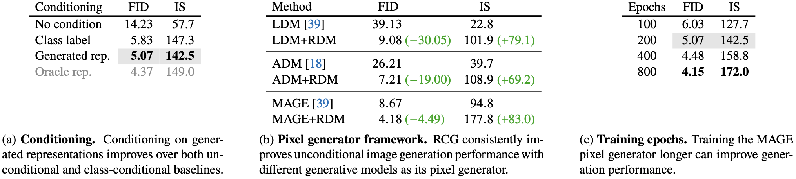

# [论文笔记] RCG: 通过生成表示的自条件图像生成

Author: <a href="https://yusijin02.github.io/">Sijin Yu</a>

[TOC]

> **论文基本信息**:
>
> **标题**: Self-conditioned Image Generation via Generating Representations
> **作者**: Tianhong Li, Dina Katabi, Kaiming He
> **arXiv**: https://arxiv.org/abs/2312.03701
> **GitHub**: https://github.com/LTH14/rcg

## 1. Abstract

- 本文提出了**表示条件图像生成 (Representation-Conditioned image Generation, RCG)**, 这是一个简单而有效的图像生成框架, 它在类别无关的图像生成方面树立了新的基准.
- RCG 不需要任何人类标注作为生成条件. 取而代之的是, 它以一个**自监督表示分布 (self-supervised representation distribution)** 为条件, 该分布是通过使用预训练的编码器从图像分布中映射得到的.
- 在生成过程中, RCG 使用**表示扩散模型 (representation diffusion model, RDM)** 从这种表示分布中采样, 并利用**像素生成器**在采样得到的表示的条件下生成图像像素.
- 这样的设计在生成过程中提供了重要的指导, 从而实现了高质量的图像生成.
- 在 ImageNet 256×256 上测试, RCG 实现了 3.31 的 FID 和 253.4 的 Inception Score (IS).
- 这些结果不仅显著提升了类别无关图像生成的最新水平, 而且还与当前类别有条件图像生成的领先方法相媲美,弥补了这两项任务之间长期存在的性能差距.

## 2. Motivation & Contribution

### 2.1 Motivation

- 有条件的图像生成利用人类标注 (如类别标签或文本描述) 取得了显著成果, 而无条件图像生成, 即省略这些条件元素, 历来是更具挑战性的任务, 效果通常不够理想.
- 这种分歧反映了监督学习和无监督学习之间的差异. 无监督学习在性能上长期落后于监督学习, 但随着自监督学习 (SSL) 的出现, 这一差距已经缩小.
- 自监督学习从数据本身生成监督信号, 取得了与监督学习相当或更优的结果, 这启发了作者将自监督学习的概念应用于图像生成领域.
- 自条件图像生成不依赖人类标注, 为图像生成在超出人类标注能力范围的领域 (如分子设计或药物发现) 开辟了新道路.

### 2.2 Contribution

- 提出了一种自条件图像生成方法, 通过数据分布衍生的表示分布条件化像素生成过程, 更直观地实现无条件图像生成.
- 开发了表示扩散模型 (RDM), 用于生成低维自监督图像表示, 捕获表示空间底层分布的多样性, 并简化了表示生成任务.
- 提出了表示条件图像生成 (RCG) 框架, 包括三个组件: SSL 图像编码器、RDM、基于表示的像素生成器, 实现了无条件图像生成性能的大幅提升.
- 在 ImageNet 256×256 上的评估表明, RCG 在无条件图像生成方面显著优于现有方法, 甚至与现有有条件生成基准相媲美, 表明自条件图像生成的巨大潜力.

## 3. Model

模型分为三个部分: 

(a) 使用一个 image encoder (例如 Moco v3) 将原始图像分布 (Image Dist.) 映射到一个低维的**表示分布 (representation distribution, Rep. Dist.)**.

(b) 学习一个表示生成器 (Rep. Generator), 将噪音分布 (Noise Dist.) 映射到表示分布 (Rep. Dist.).

(c) 学习一个像素生成器 (例如 LDM 或 MAGE) 将噪音分布 (Noise Dist.) 映射到图像分布 (Image Dist.), 并以表示分布 (Rep. Dist.) 为条件.

### 3.1 Image Encoder

- RCG 使用预训练的图像编码器将图像分布转换为表示分布.
- 这个分布具有两个基本特性:
  - **简单性**: 易于通过表示扩散模型进行建模.
  - **丰富性**: 在引导像素生成方面富含高层次语义内容.
- 使用自监督对比学习方法 (Moco v3) 预训练的图像编码器. 该方法在保持表示学习在 ImageNet 上的最新水平的同时, 将表示**正则化到超球面上**.
- 我们取投影头 (256维) 后的表示, 并将每个表示按其自身的均值和标准差进行标准化.

### 3.2 Representation Generator

- RCG 使用一个简单但有效的表示扩散模型 (RDM) 来从表示空间中采样.
- RDM 采用带有多个残差块的全连接网络作为其主体结构.
- 每个块包含一个**输入层**、一个**时间步嵌入投影层**、一个**输出层**.
- 其中每层由 **LayerNorm**、**SiLU**、**线性层**组成.
- 这样的架构由两个参数控制: 残差块的数量 $N$ 和隐藏维度 $C$.
- RDM 遵循去噪扩散隐式模型 (Denoising Diffusion Implicit Models, DDIM) 进行训练和推理. 如下图所示. 
  - 在训练过程中, 图像表示 $z_0$ 与标准高斯噪声变量 $\epsilon$ 混合: $z_t=\sqrt{\alpha_t}z_0+\sqrt{1-\alpha_t}\epsilon$. 然后训练 RDM 主干网络将 $z_t$ 去噪回 $z_0$.
  - 在推理过程中, RDM 按照 DDIM 采样过程从高斯噪声生成表示.
- 由于 RDM 处理的是高度压缩的表示, 因此无论是在训练还是生成过程中, 它都只带来边际计算开销.

### 3.3 Pixel Generator

- RCG 中的像素生成器根据图像表示来生成图像像素.
- 从概念上讲, 这样的像素生成器可以是**任何现代的条件图像生成模型**, 只需将其原始条件 (例如: 类别标签或文本) 替换为自监督学习 (SSL) 表示.
- 如上图所示, 以 MAGE 为例, 它是一个**并行解码的生成模型**. 
- 像素生成器被训练为从图像的掩码 (mask) 版本重建原始图像, 条件是相同图像的表示. 在推理过程中, 像素生成器从完全掩蔽的图像生成图像, 条件是来自表示生成器的表示.
- 我们尝试了三种代表性的生成模型: ADM 和 LDM, 它们都是基于扩散的框架, 以及 MAGE, 一个并行解码框架.
- 我们的实验表明, 当这三个生成模型基于高层次表示进行条件化时, 都能达到更好的性能.

### 3.3 Classifier-free Guidance

- RCG 的一个优势是它能无缝地为无条件生成任务提供无分类器引导.
- 无分类器引导以提升生成模型性能而闻名, 传统上不适用于无条件生成框架. 这是因为无分类器引导旨在通过无条件生成为有条件图像生成提供指导.
- 尽管 RCG 也是为无条件生成任务设计的, 但 RCG 的像素生成器是基于自监督表示条件化的, 因此可以无缝集成无分类器引导, 进一步提升其生成性能.
- RCG 遵循 Muse 在其 MAGE 像素生成器中启用无分类器引导.
  - 在训练期间, 有 10% 的概率不根据 SSL 表示对 MAGE 像素生成器进行训练.
  - 在每个推理步骤中, MAGE 预测了一个基于 SSL 表示的 logit $l_c$，以及每个掩码标记的一个无条件 logit $l_u$. 最终 logits $l_g$ 通过指导尺度 $\tau$ 从 $l_u$ 向 $l_c$ 移动而形成: $l_g=l_c+\tau(l_c-l_u)$. 然后 MAGE 根据 $l_g$ 来填补剩余的掩蔽标记.

## 4. Experiment

### 4.1 Setup

- **Dataset**: ImageNet 256x256.
- **Metrics**: 生成 50k 张图像, 并计算 FID 和 IS.

### 4.2 Comparison Result

- 和条件生成模型的对比.

- 计算代价的对比.

  

### 4.3 Ablation Result

- $\tau$ 的消融.

  

- 预训练模型、模型大小、映射维度的消融.

  

- 模型深度、模型宽度、训练 RDM 的 epoch、diffusion steps 的消融.

  

- 生成的条件、像素生成器的框架、训练像素生成器的 epoch 的消融.

  

